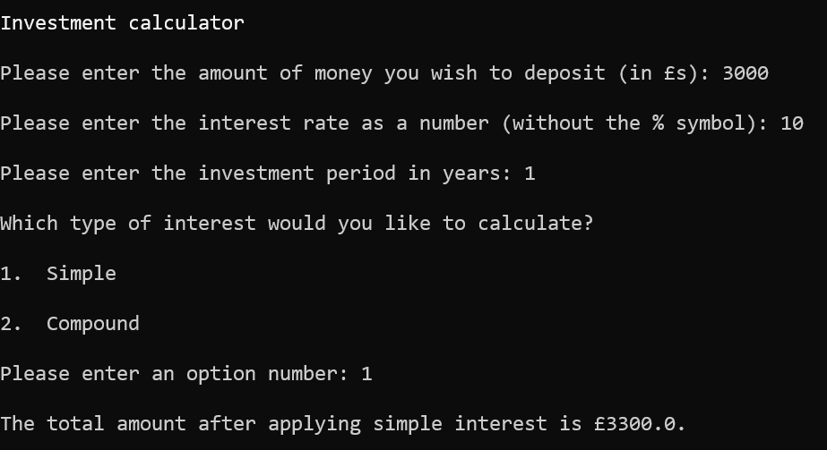

# 💷💹 Finance Calculators

## About this project

This is a finance calculator program that allows the user to:

* calculate simple interest
* calculate compound interest
* calculate the repayment period on a mortgage

## Download / Installation

The only file required to run this program is finance_calculators.py

The program uses the following standard Python libraries:
* os
* math

For information on installing Python 3, please see the link below:

https://www.python.org/downloads/

## Instructions for use

The main menu prompts to select one of two calculators:

### Investment - calculate interest earned on an investment

The user is prompted to enter:
* an investment amount
* an interest rate percentage
* the investment period in years
* whether they want to calculate **simple** or **compound** interest

The program then calculates and displays the total amount (capital + interest) after the given period.

  Example:

  

### Mortgage - calculate monthly repayment amounts

The user is prompted to enter:
* the current value of a property
* the interest rate percentage
* the number of months they wish to repay the mortgage over

The program then calculates and displays the monthly repayment amount based on the information provided.

## Potential improvements

* include a wider range of calculators
* add a graphical user interface
* provide the option to enter the mortgage period in months or years

## Learning

This was my first Python project, and was helpful in terms of consolidating my knowledge of:

* while loops
* error handling
* mathematical operations
