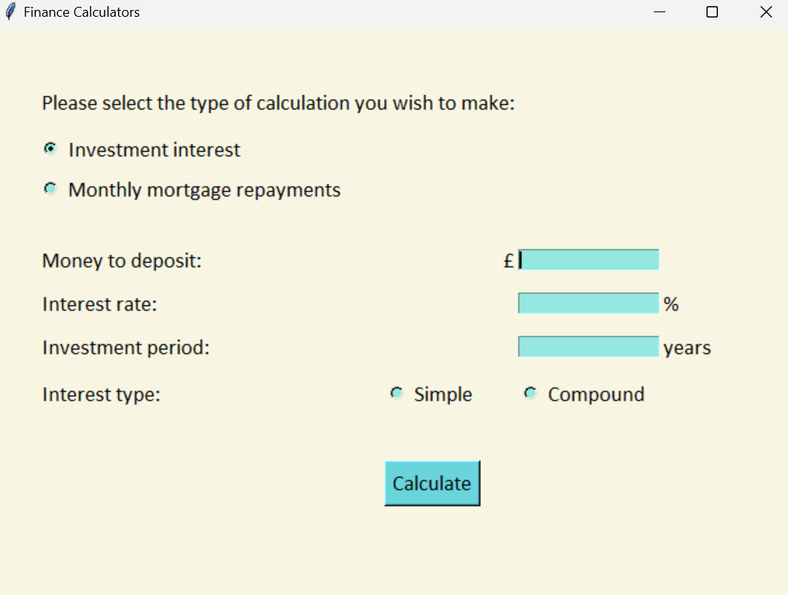
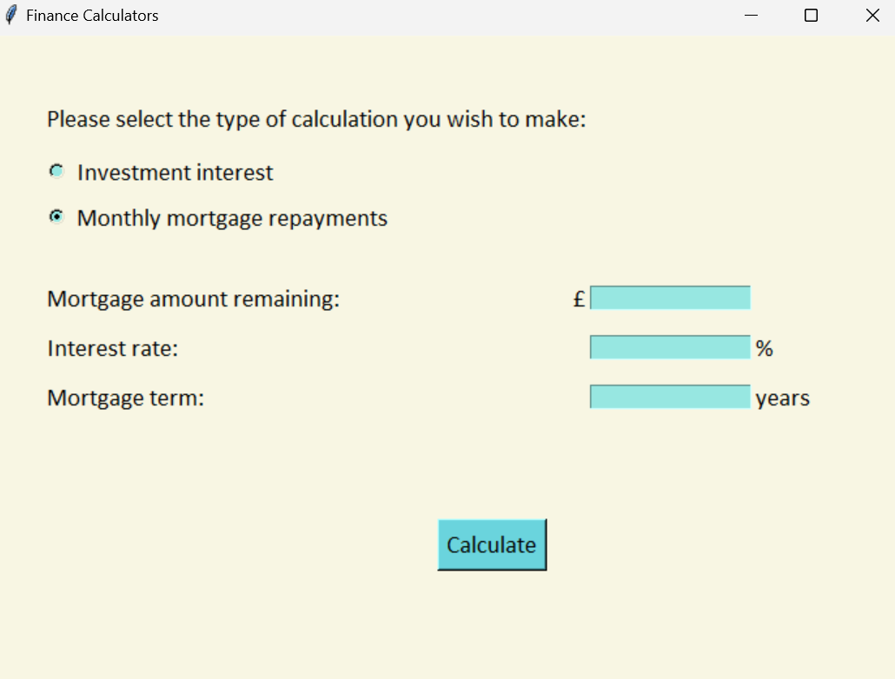

# 💷💹 Finance Calculators

## About this project

This is a finance calculator program that allows the user to:

* calculate an investment's value after applying simple or compound interest
* calculate the monthly repayment amounts for a mortgage

It was originally a command line programme written as the first capstone
project of my recent bootcamp. I later revisited the project after learning
about Tkinter, and added a GUI.

## Technologies / Dependencies

This project was created using:

* Python 3.12
* Tkinter

For information on installing Python 3, please see the link below:

https://www.python.org/downloads/


## Setup

To run this project, save the following file locally:

* finance_calculators.py

To run the script:

* open the terminal or command-line interface
* navigate into the folder containing the file
* for Windows, enter the following command :
```
python finance_calculators.py
```
* for Mac/Linux:
```
python3 finance_calculators.py
```

## Instructions for use

The main menu prompts to select one of two calculators:

### Investment - calculate interest earned on an investment

The user is prompted to enter:
* an investment amount
* an interest rate percentage
* the investment period in years
* whether they want to calculate **simple** or **compound** interest

The program then calculates and displays the total amount (capital + interest) after the given period.

   

### Mortgage - calculate monthly repayment amounts

The user is prompted to enter:
* the current value of a property
* the interest rate percentage
* the number of months they wish to repay the mortgage over

The program then calculates and displays the monthly repayment amount based on the information provided.

  

## Learning

This was my first Python project, and was helpful in terms of consolidating my knowledge of:

* while loops
* error handling
* mathematical operations

It later allowed me to practise creating graphical interfaces with Tkinter.
